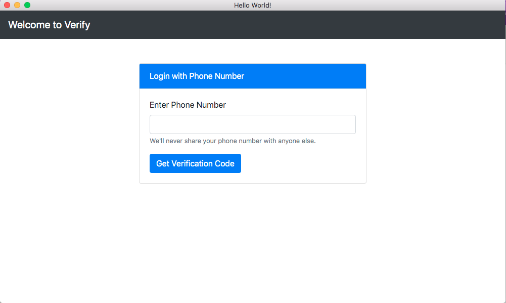

# Electron.js Authentication using Twilio Verify

## Project Setup

### Prerequisites

- Node.js Installed
- [Yarn](https://yarnpkg.com/) installed

### Configuration

- Navigate to the root of the folder
- Install dependencies using `npm install`
- Create a `.env` file at the root and fill in the details shown below:

```
TWILIO_SID=XXX-XX-XXXXX
TWILIO_TOKEN=XXX-XX-XXXXX
VERIFY_SERVICE_ID=XXX-XX-XXXXX

```

- Run the application using `npm start`

## Screenshots

Login Page


